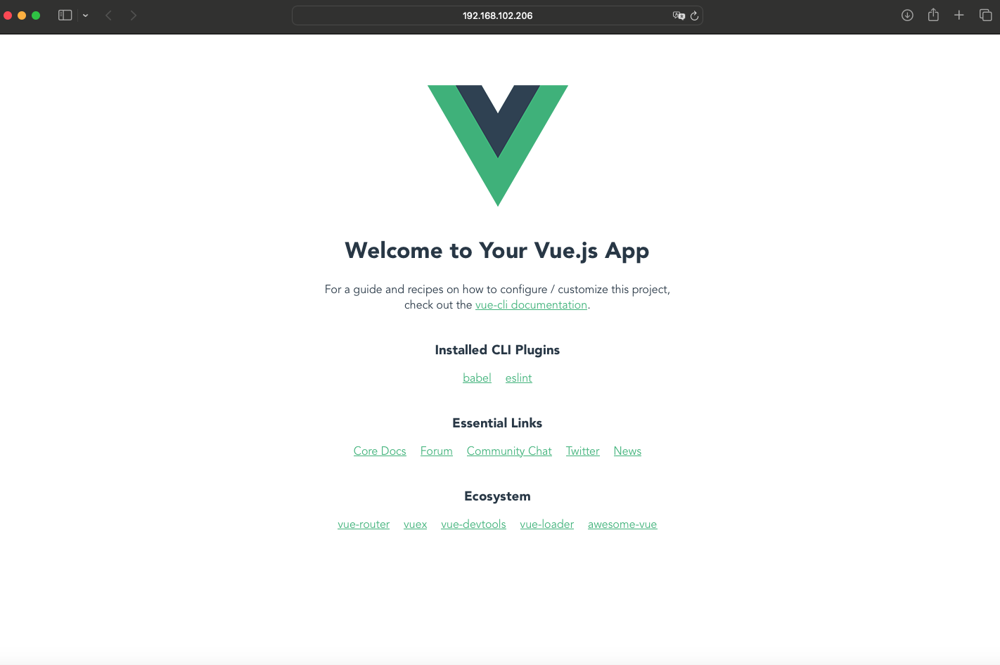

**Vue-cli와 설치**

* Vue CLI는 애플리케이션 개발을 지원하는 Command Line Interface이다.
  * Vue 프로젝트 생성
  * Vue 라이브러리 관리
  * 패키지 배포를 위한 Webpack 자동 설정
  * Vue GUI 제공

<br>

**1) Vue-cli 설치**

```
npm install -g @vue/cli
```

<br>

**2) Vue-cli 프로젝트 생성**

```
vue create 프로젝트명
```

<br>

**3) 서비스 구동**

```
npm run serve
```

