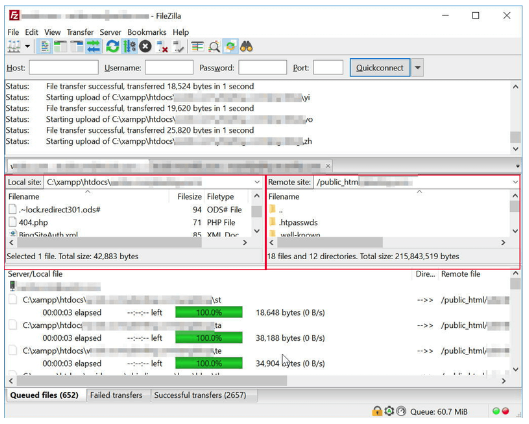

**파일 질라(FileZilla)란?**

* 파일 질라는 FTP(File Transfer Protocol) 프로그램 중 하나이다.
* 즉, 사용자의 편의를 위해 자동으로 규칙에 맞춰 개인 컴퓨터와 운영 서버 간에 파일을 전송할 수 있도록 하는 프로그램이다.

 

**사용 화면**

* 왼쪽 빨간 박스 안 : Local Site(주로 본인의 컴퓨터)
* 오른쪽 빨간 박스 안 : Remote Site(주로 Web Server Site)