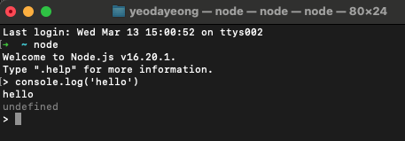

**Node.js란?**

* 공식 홈페이지) Node.js란 Chrome V8 JavaScript 엔진으로 빌드된 JavaScript 런타임이다.
* 이때, 런타임은 특정 언어로 만든 프로그램들을 실행할 수 있는 환경을 뜻한다.

 

**JavaScript란?**

* HTML에 종속되어 있는 언어로, HTML 조작과 변경을 위해 사용한다.
* 정적 언어인 HTML을 조작해서 웹페이지를 다이나믹하게 바꿔주는 기능을 한다.
* 브라우저에 자바스크립트 해석 엔진이 있기 때문에, 기존에는 자바스크립트를 인터넷 브라우저 위에서만 실행할 수 있었다.
* 그러나, Node.js가 등장하며, 브라우저 내에서 말고 다른 환경에서도 자바스크립트를 사용할 수 있게 되었다.

 

**Node.js는 JavaScript 실행 환경(=런타임)이다.**

* Node.js를 사용하면 브라우저를 키지 않아도 자바스크립트를 컴퓨터에서 수행할 수 있다!

 

**Node.js로 서버를 만드는 이유**

* 가정
  * 손님이 4명
  * 1번째 손님은 티켓을 1장 구매
  * 2번째 손님은 티켓을 1장 구매
  * 3번째 손님은 티켓을 200장 구매
  * 4번째 손님은 티켓을 1장 구매
* 일반 서버의 경우
  * 서버가 3번째 손님의 티켓을 모두 준비하고 마무리될 때까지 4번째 손님도 함께 기다려야 한다.
* Node.js로 개발한 서버의 경우
  * 모든 손님의 요청을 한번에 받아서 순서와 상관없이 처리 속도가 빠른 것부터 결과를 가져다준다.
  * 4번째 손님은 굳이 3번째 손님의 요청이 끝날 때까지 기다릴 필요가 없다.
  * => **Non-blocking I/O**

 

**Node.js의 강점**

* Node.js 서버로 구현하면 요청이 많거나 오래 걸리는 요청이 있어도 멈추거나 요청 대기 시간이 발생하지 않는다.
* 이런 Non-blocking 덕분에 채팅이나 SNS에 자주 사용된다.

 

**Node.js의 단점**

* Node.js는 모두 스레드 하나에서 처리된다. (**싱글 스레드**)
* 코드가 CPU 연산을 많이 요구하면 스레드 하나가 감당하기 어렵다.
* 그렇기 때문에 이미지나 비디오 처리, 대규모 데이터 처리와 같이 CPU를 많이 사용하는 작업을 위한 서버로는 권장되지 않는다.