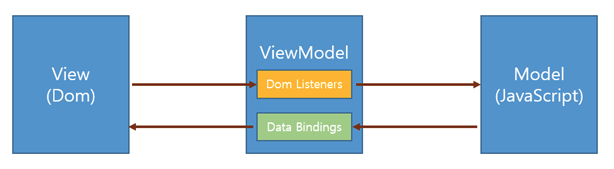

**Vue.js란?**

* 웹 페이지 화면 개발을 위한 JavaScript 프레임워크이다.
* 프레임워크가 전체적인 흐름을 스스로 쥐고 있으며 사용자가 그 안에서 필요한 코드를 짜 넣을 수 있다.

<br>

**Vue.js의 특징**

1. Vue.js의 동작 원리
   * 화면에 변화가 있을 때마다 실시간으로 DOM Tree를 수정하지 않고 변경사항이 반영된 **Virtual DOM**을 이용해 메모리에서 처리하고 한 번만 DOM을 수정한다.
   * 결과적으로 브라우저는 한 번만 렌더링을 하게 됨으로써 불필요한 렌더링 횟수를 줄여 렌더링 성능을 높인다.

<br>

2. MVVM 패턴

   

   * Vue.js는 MVVM(Model-View-ViewModel)을 따른다.
   * View는 사용자가 보고 있는 내용, Dom(Document Object Model)이다.
   * View의 데이터를 ViewModel의 Dom Listeners가 감지해서 Model에게 전달한다.
   * 반대로 Model의 데이터는 ViewModel의 Data Bindings를 통해 View로 전달한다.

<br>

3. 컴포넌트 기능

   * Vue.js의 컴포넌트 기능은 기능 별로 자바스크립트와 템플릿을 하나의 세트로 묶어서 다른 기능과 분리하여 개발할 수 있도록 한다.

   * 그래서 하나의 기능에만 충실한 컴포넌트 제작이 가능하고, 이러한 컴포넌트를 조립해 새로운 페이지를 만들 수 있다.

   * Vue 인스턴스를 생성한다.

     ```javascript
     //생성자 함수
     var vm = new Vue({
       el: '#app'
     })
     ```

   * 생성한 인스턴스에 컴포넌트를 추가한다.

     ```javascript
     <!DOCTYPE html>
     <html lang="en">
       <head>
         <meta charset="UTF-8" />
         <meta http-equiv="X-UA-Compatible" content="IE=edge" />
         <meta name="viewport" content="width=device-width, initial-scale=1.0" />
         <title>Document</title>
       </head>
       <body>
         <div id="app">
           <top-menu></top-menu>
           <left-menu></left-menu>
     		</div>
         <script src="https://cdn.jsdelivr.net/npm/vue/dist/vue.js"></script>
         <script>
           var vm = new Vue({
             el: '#app',
             components: {
               'top-menu': {
                 template: '<ul><li>menu1</li><li>menu2</li></ul>',
               },
               'left-menu': {
                 template: '<ul><li>left1</li><li>left2</li></ul>',
               },
             },
           })
         </script>
       </body>
     </html>
     ```

<br>

**Vue.js의 장점**

* React, Angular에 비해 배우기 쉽다.
* React(Virtual DOM), Angular(데이터 바인딩)의 장점을 취했다.
* 가볍고 성능이 빠르다.
* 컴포넌트 기반 프레임워크로 컴포넌트 조합으로 뷰 구성, 코드 재사용이 쉽다.